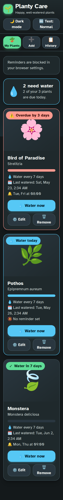
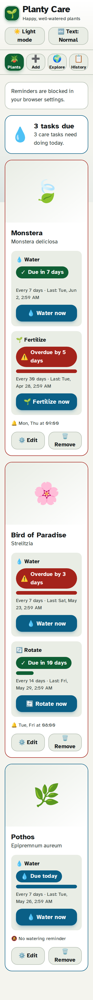
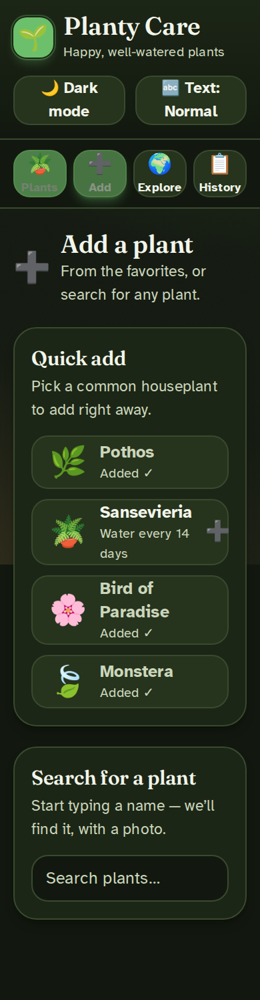
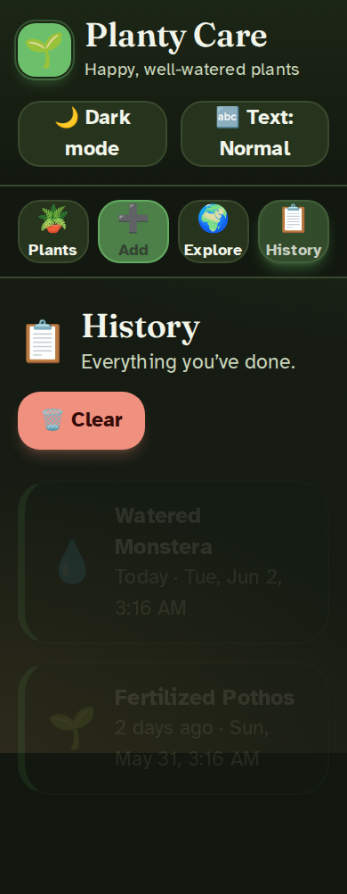

# 🌱 Planty Care

A friendly app to track plant watering schedules, set reminders, and keep a
history of every watering. Built as a fast, accessible single-page app and
deployed to **GitHub Pages**.

   

## Screenshots

Captured automatically in CI by Playwright on every push to `main`
(see `.github/workflows/e2e.yml`).

| Dark — My Plants | Light — My Plants |
| --- | --- |
|  |  |

| Dark — Add | Dark — History |
| --- | --- |
|  |  |

## Features

- **My Plants** — every plant with a photo, watering status (water today /
  overdue / water in N days), last-watered time, and reminder summary. Sorted
  most-urgent first.
- **Quick add** built-ins: Pothos, Sansevieria, Bird of Paradise, Monstera.
- **Look up new plants** — search any plant and pull a photo + description from
  the **Wikipedia REST API** (no API key, CORS-friendly → works on static
  hosting).
- **Reminders** — pick weekdays + a time per plant; browser notifications fire
  while the page is open.
- **History** — a running, human-friendly log of every watering.
- **Built for low vision / glaucoma** — see below.

### Accessibility (designed around glaucoma)

The UI is tuned for an older user with glaucoma (reduced contrast sensitivity,
light sensitivity, and peripheral-field / "tunnel" vision):

- **Light + dark themes, dark by default** (light text on a dark, off-black
  canvas). A clearly-labelled toggle switches and remembers the choice.
- **AAA contrast (≥ 7:1)** for every text/background and button pairing,
  verified numerically — in both themes.
- **Atkinson Hyperlegible** font (designed for low vision) at a large 20px
  baseline, with a 3-step **Normal / Large / Largest** size control.
- **Halation-aware**: light-on-dark text is kept crisp with large, bold type
  and an off-black (not pure-black) canvas rather than by dimming contrast.
- **Tunnel-vision friendly**: a single, centered, narrow column on every screen
  size; navigation and feedback stay in the central field (toasts appear
  centered, not at a screen edge).
- **Status uses colour + icon + word**, never colour alone.
- **Large touch targets** (≥ 52px) with generous spacing, strong focus rings,
  `scroll-padding` so the sticky nav never hides the focused element, off-white
  (not pure-white) light mode to cut glare, and reduced-motion support.

All data lives in your browser (`localStorage`); nothing is sent to a server.

## Tech stack

| Concern | Choice |
| --- | --- |
| Build / dev | **Vite 7** |
| UI | **React 19** + **TypeScript** (strict) |
| Styling | **Tailwind CSS v4** (design tokens via `@theme`) |
| Tests | **Vitest** + **React Testing Library** (jsdom) |
| Linting | **ESLint 9** (flat config) + typescript-eslint |

### Architecture

```
src/
  lib/         pure logic — watering math, storage, Wikipedia client,
               notifications, formatting (heavily unit-tested)
  hooks/       usePlants (state + persistence), useReminders, useTextSize
  components/  presentational + feature components (ui/ holds primitives)
  data/        preset plants
  types.ts     shared domain types
```

The domain logic is split into small pure functions so it can be tested without
a DOM, and React components stay thin.

## Develop

```bash
npm install
npm run dev        # start the dev server
npm test           # run the test suite
npm run lint       # lint
npm run build      # type-check + production build → dist/
```

## Deploy to GitHub Pages

`.github/workflows/deploy-pages.yml` runs the tests, builds with the correct
base path (`/plant-water-schedule/`), and deploys on every push to `main`.
Enable it once under **Settings → Pages → Source: GitHub Actions**. The app
then lives at `https://<username>.github.io/plant-water-schedule/`.

> The Vite `base` is only applied when the `GITHUB_PAGES` env var is set (done
> in CI), so local dev still serves from `/`.

## Notes on reminders

Browser notifications fire only while the page is open. Always-on reminders
would need a Service Worker + Push API and a push server — out of scope for a
pure static site.
